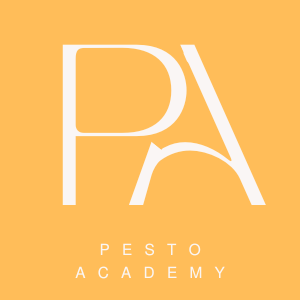

# Pesto Academy

## Vision
Create economic and personal growth through innovative and inclusive learning experiences.

## Our Value
The pandemic happened, the Great Resignation resulted, but even given recent Big Tech layoffs, the job market remains strong with unemployment at historic lows. With the pervasiveness of technology and increasing expectations of data and analytics, companies continue to suffer from a deficit of technical talent, especially software developers and cyber professionals. The resulting talent war continues with companies struggling as the lack of a resilient talent supply chain impedes productivity and growth.

This challenge requires a new level of employer investment in workforce development and the Pesto Academy is creating the solution – an apprentice model where lean and agile processes are applied that minimize the time-to-market for new talent and maximizes employer ROI. Education and training are purposeful with a narrow focus on current tools, patterns, and practices required for the job; the learning process emulates the team environment and culture; and learners transition to into billable professionals as soon as possible. A talent pipeline is created where employers make early investments in talent to pull prospects into junior positions.

## Strategic Plan
+ As a non-profit, we support very young learners by providing coaching to early Lego League Robotics program.
+ As a non-profit, we partner with Cisco Network Academy to deliver basic computer skills and cybersecurity training to the Petoskey community at no cost, supporting Michigan’s Digital Inclusion goals.
+ As a non-profit, we commit to creating a coalition of employers and educators working to create an IT talent pipeline with an initial focus on software development. This effort is the next iteration of our similar non-profit initiative, [tccodes.org](https://tccodes.org) 
+ Our proof-of-concept service is well established with immediate approval of a STEM Registered Apprenticeship Program from the Department of Labor. Seven software developer apprentices are enrolled and managed through our local Michigan Works! office. This is an earn-while-you-learn model with Related Technical Instruction provided by the Pesto Academy to the apprentices at no cost. This STEM Apprenticeship is the first in our region and one of a select few in the State.

## News
some news

## People
our people

